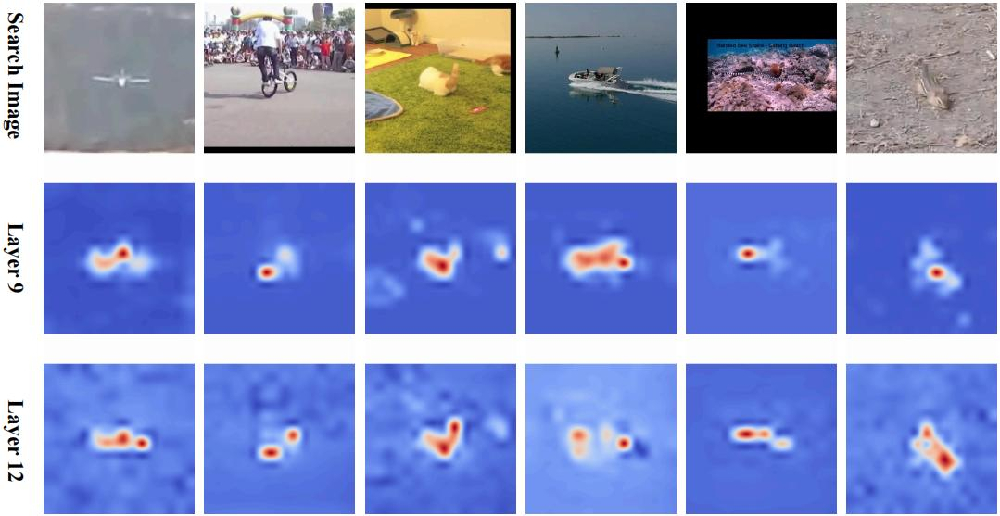

# BTTrack
*


[[BTTrack_Models](https://drive.google.com/drive/folders/1nUFR6wUZS4kIIl_s_RitrtJsmhI3i2OK?usp=drive_link)] , [[Pretrained_Models](https://drive.google.com/drive/folders/1srymjGw__HeMswkzvqbk5H0qMJTRvYD1?usp=drive_link)]]

This is an official pytorch implementation of the paper BTTrack: Bridge Token Learning for Efficient Visual Object Tracking. (Under Review)


## Highlights





### performance


| Tracker           | LaSOT (AUC) | LaSOT_ext (AUC) | TrackingNet (AUC) | GOT10K (A0) | Params (M) | FLOPS (G) | 
|-------------------|-------------|-----------------|-------------------|-------------|------------|-----------|
| **BTTrack-B256**  | 67.3  | 47.0    | 83.0       | 73.4  |92	      | 30.0|
| **BTTrack-T256**  | 64.7      | 44.6      | 80.9      | 70.0       | 8|2.6|


| Tracker           | UAV123 (AUC) | UAV20L (AUC) | UAV10fps (AUC) | DTB70 (AUC)| UAVTrack112 (AUC)  | UAVDT (AUC) |  VisDrone (AUC) | 
|-------------------|--------------|--------------|----------------|------------|--------------------|-----------|-----------|
| **BTTrack-B256**  | 67.1         | 66.5         | 66.1           | 67.3       |70.3                | 62.0| 63.9|
| **BTTrack-T256**  | 67.2         | 67.1         | 66.0           | 66.4       | 69.0               |60.3| 64.5|


## Install the environment (follow OSTrack)
```
conda create -n bttrack python=3.8
conda activate bttrack
bash install.sh
```

* Add the project path to environment variables
```
export PYTHONPATH=<absolute_path_of_BTTrack>:$PYTHONPATH
```

## Data Preparation
Put the tracking datasets in [./data](data). It should look like:

   ```
   ${BTTrack_ROOT}
    -- data
        -- lasot
            |-- airplane
            |-- basketball
            |-- bear
            ...
        -- got10k
            |-- test
            |-- train
            |-- val
        -- coco
            |-- annotations
            |-- images
        -- trackingnet
            |-- TRAIN_0
            |-- TRAIN_1
            ...
            |-- TRAIN_11
            |-- TEST
        -- vasttrack (we only use a downsample version)
            |-- Zither
            |-- Zebra
            ...
   ```

## Set project paths
Run the following command to set paths for this project
```
python tracking/create_default_local_file.py --workspace_dir . --data_dir ./data --save_dir .
```
After running this command, you can also modify paths by editing these two files
```
lib/train/admin/local.py  # paths about training
lib/test/evaluation/local.py  # paths about testing
```

## Train
Download [pre-trained weights](https://drive.google.com/drive/folders/1srymjGw__HeMswkzvqbk5H0qMJTRvYD1?usp=drive_link) and put it under [./pretrained_models](pretrained_models)

### Train BTTrack
```
bash xtrain.sh
```


## Test and evaluate on benchmarks
Put the downloaded checkpoints under [./checkpoints/train/bttrack](/checkpoints)
- Support Eval LaSOT LaSOT_ext GOT-10k TrackingNet UAV123 UAV20L UAV10fps DTB70 UAVDT VisDrone2019 UAVTrack112 TNL2k OTB NFS .... 
```
bash ytest.sh
```


## Test FLOPs and Params
```
python tracking/profile_model.py --script bttrack --config vit_tiny_ep300
```


## Contact
* Biao Wang (email:wangbiao301@buaa.edu.cn)


